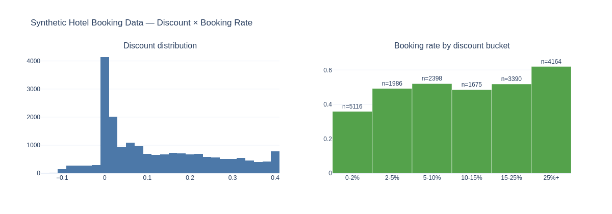
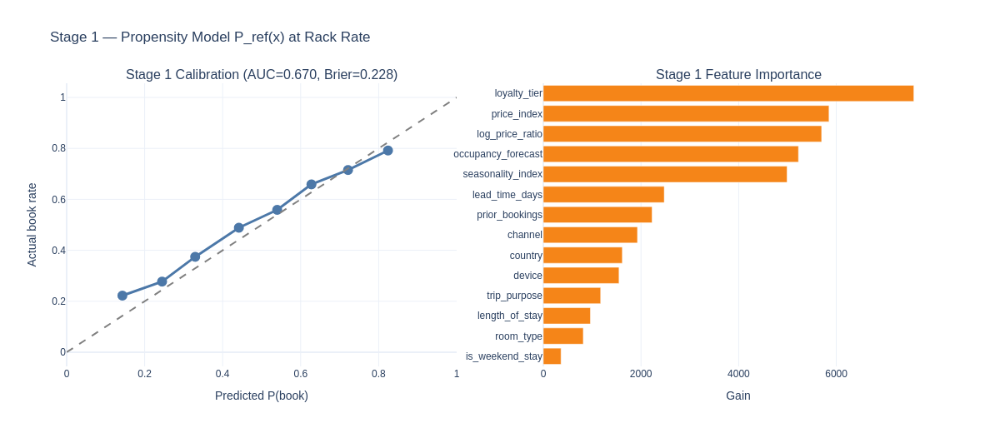
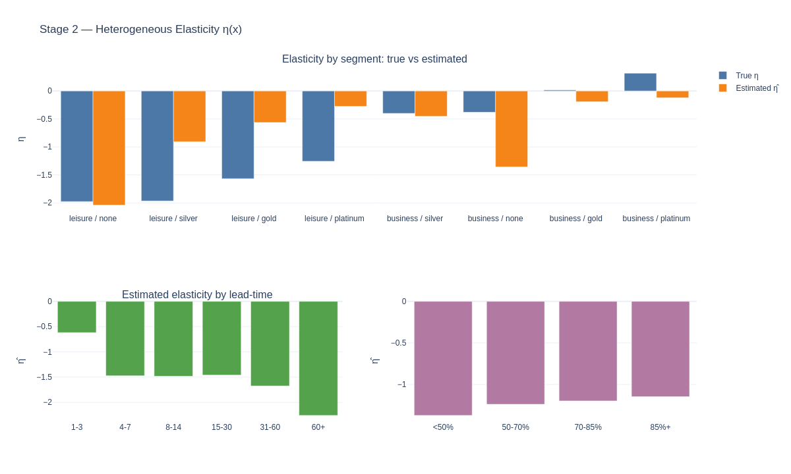
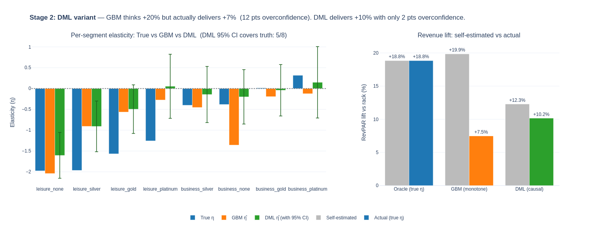
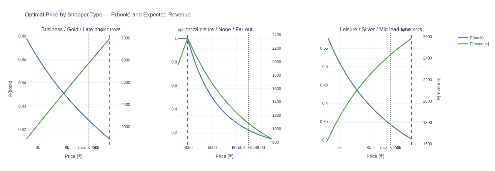
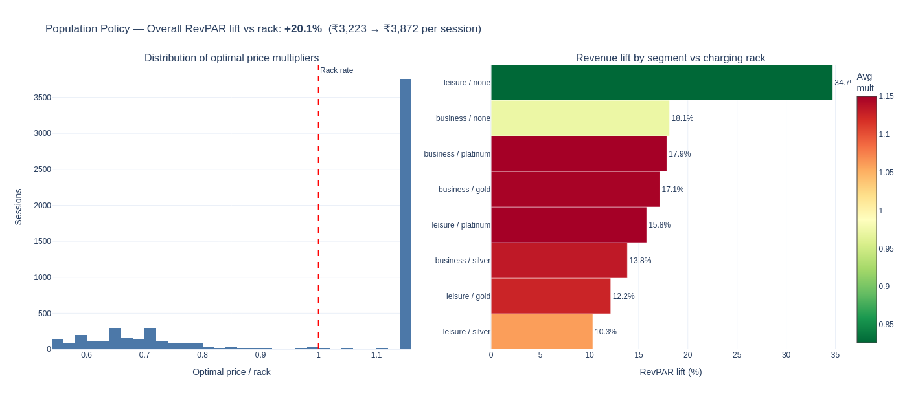
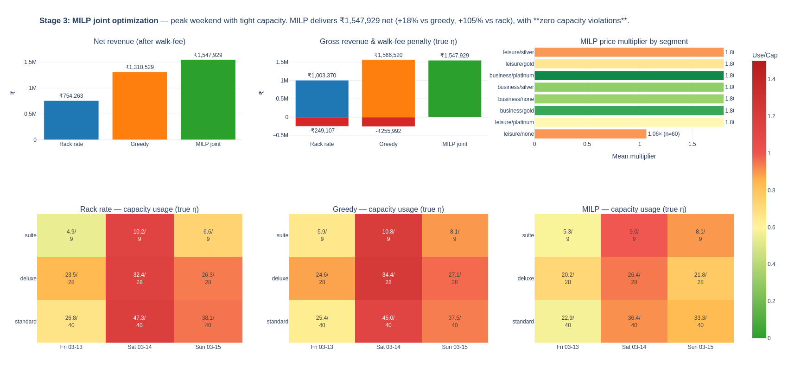

# Hotel Pricing AI System — Complete Documentation

> **Audience:** Business stakeholders, data scientists, and engineers.
> Every technical term is explained in plain language the first time it appears.
> Charts from the live demo system are embedded inline.


---

## Table of Contents

1. [The Problem — Why Hotels Leave Money on the Table](#1-the-problem)
2. [The Solution — A Three-Stage AI Pricing System](#2-the-solution)
3. [The Data — What We Feed the System](#3-the-data)
4. [Stage 1 — Who Is Likely to Book? (Propensity Model)](#4-stage-1--who-is-likely-to-book)
5. [Stage 2A — How Price-Sensitive Is Each Shopper? (GBM)](#5-stage-2a--gbm-elasticity)
6. [Stage 2B — A More Honest Elasticity via DML](#6-stage-2b--dml-causal-elasticity)
7. [Optimal Price for Individual Shoppers](#7-optimal-price-for-individual-shoppers)
8. [Stage 3 — Peak Nights: MILP Capacity Optimization](#8-stage-3--milp-capacity-optimization)
9. [Why Not a Single Model?](#9-why-not-a-single-model)
10. [Running the Demo](#10-running-the-demo)
11. [Glossary](#11-glossary)

---

## 1. The Problem

Most hotels display the same price to every visitor at the same point in time — a single **rack rate** (the standard undiscounted list price) that management sets weekly or daily. This one-size-fits-all approach has two simultaneous failure modes and one operational disaster:

| Failure Mode | What Happens | Revenue Impact |
|---|---|---|
| **Overpricing leisure travellers** | A family planning a holiday 60 days out is very sensitive to price. They close the tab and book a competitor. | Lost booking entirely |
| **Underpricing business travellers** | An executive booking 2 days before travel will pay almost anything. Rack rate leaves significant revenue uncaptured. | Unrealised upside |
| **Overselling peak nights** | Even "correct" per-shopper prices, applied without awareness of room inventory, cause overbooking. Walk fees (paying guests to move to another hotel) erase all gains. | Operational loss |

> **Core insight:** Different shoppers respond to price in completely different ways. A system that personalises price per shopper — and respects the hotel's physical room inventory — can simultaneously capture more revenue from price-insensitive guests and fill rooms that would otherwise go empty.

---

## 2. The Solution

Three stages answer three questions in sequence before quoting any price:

```
┌─────────────────────────────────────────────────────────────────────────┐
│  Stage 1 · Propensity        Stage 2 · Elasticity     Stage 3 · MILP   │
│                                                                         │
│  Would this shopper   →   How much does their  →   What prices, for    │
│  book at rack rate?       probability change       ALL shoppers, fit   │
│                           when price changes?       within room limits? │
│                                                                         │
│  Output: P_ref(x)          Output: η(x)             Output: p* per     │
│  (booking probability      (elasticity per           session            │
│   at rack rate)             shopper)                                    │
└─────────────────────────────────────────────────────────────────────────┘
```

### The Pricing Formula

The combined probability that a shopper books at a given price `p` is:

```
P(book | x, p) = P_ref(x)  ×  (p / rack_rate) ^ η(x)
```

**In plain English:**

- `P_ref(x)` — baseline chance of booking (from Stage 1)
- `(p / rack_rate)` — the price ratio: 1.0 means rack rate, 1.2 means 20% above, 0.8 means 20% discount
- `^ η(x)` — raise the price ratio to the power of the elasticity. Because elasticity `η` is negative, charging more than rack rate makes this term shrink below 1.0 — reducing booking probability. The bigger the negative number, the faster probability drops.

---

## 3. The Data

The system is trained on 20,000 synthetic hotel booking sessions. Each session represents one visit to the booking page.

### Features (Inputs)

| Feature | Plain-English Meaning | Why It Matters |
|---|---|---|
| `trip_purpose` | Business or leisure trip | Business travellers are generally less price-sensitive |
| `loyalty_tier` | None / Silver / Gold / Platinum member | High-loyalty guests book more often regardless of price |
| `lead_time_days` | Days before the stay at time of booking | Last-minute = inelastic; far-out = very elastic |
| `length_of_stay` | Number of nights | Affects how much capacity is consumed |
| `room_type` | Standard / Deluxe / Suite | Defines which inventory pool is consumed |
| `occupancy_forecast` | Predicted hotel occupancy for that night | High occupancy makes guests less sensitive (fewer alternatives) |
| `device` | Mobile / Desktop / iOS | iOS users historically convert at higher rates |
| `channel` | Direct / OTA / Meta-search | Context: shoppers compare prices differently by channel |
| `price_index` | Our price ÷ competitor average | Relative value matters more than absolute price |
| `rack_rate` | Our standard undiscounted room price | Reference point for all multipliers |

### The A/B Test Arm — Why It's Non-Negotiable

30% of training sessions were shown a **randomly assigned price** (not the usual algorithmic price). This is called an **A/B test arm** — a controlled experiment baked into the data.

> **Why this matters:** Without random price variation, it is mathematically impossible to tell whether "business travellers book at high prices because they are inelastic" or "business travellers book at high prices because our system targeted them." The A/B arm provides the random variation that lets DML (Stage 2B) disentangle the two. Removing it causes DML's elasticity estimates to collapse to near-zero — see the [Glossary](#identification-statistical) for details.


*Figure 1 — Left: distribution of price discounts in training data. Right: booking rates by discount level. The upward slope as discounts increase confirms real price sensitivity in the data.*

---

## 4. Stage 1 — Who Is Likely to Book?

### Business Perspective

Before worrying about price optimisation, the system asks: **"If we charged the rack rate, what is the probability that this specific shopper would book?"**

This is called the **baseline booking probability** or **propensity** (from the Latin *propensus* — inclined toward something).

| Shopper Profile | Baseline Booking Probability | Implication |
|---|---|---|
| Platinum-loyalty business, books 1 day out | ~80% | Can charge a premium — likely to book regardless |
| Leisure, no loyalty, browsing 90 days out | ~10% | Charging extra likely loses them entirely; a discount might activate them |
| Leisure, silver loyalty, 14 days out | ~45% | Price has meaningful leverage; optimal price is somewhere between rack and slight premium |

> **Why baseline probability matters for pricing:**
> If the baseline probability is already 75%, you can charge a premium — the revenue gain outweighs the small probability drop. If the baseline is 10%, charging extra almost certainly loses the booking. Knowing the baseline before computing the optimal price is essential.

### Technical Perspective

**Model:** LightGBM classifier trained on historical booking sessions with `booked ∈ {0, 1}` as the target.

**Calibration:** After training, [isotonic calibration](#isotonic-calibration) is applied. An uncalibrated model might output "70% probability" for a group where only 50% actually book. Isotonic calibration adjusts the output scale so that when the model says 70%, approximately 70% of such shoppers really do book. This is critical because Stage 3 (MILP) uses these probabilities directly in capacity constraint calculations.

**Why does calibration matter for the MILP?**

The MILP constraint is:

```
sum of [probability × 1 if session consumes this room-night] ≤ capacity
```

If probabilities are systematically overstated (e.g., 70% when truth is 50%), the MILP will think more rooms are consumed than actually are, and will under-price. If understated, it will oversell. Calibration makes this calculation trustworthy.

### Performance Metrics

| Metric | Value | What It Means |
|---|---|---|
| AUC | 0.667 | Model correctly ranks a bookee above a non-bookee 66.7% of the time. 0.5 = random guess, 1.0 = perfect. |
| Brier Score | 0.228 | Probability accuracy. 0.0 = perfect, 0.25 = random guess. Our value shows genuine predictive signal. |
| Calibration | Good | Predicted 60% ≈ actual 60% booking rate for that group. |


*Figure 2 — Left: calibration plot — a well-calibrated model tracks the diagonal line closely. Right: feature importance — lead time, loyalty tier, and trip purpose are the strongest signals.*

---

## 5. Stage 2A — GBM Elasticity

### Business Perspective

**Elasticity** is the most important number in pricing. It answers: *"If I raise the price by 10%, how much does booking probability fall?"*

**Examples:**

```
Inelastic shopper (η ≈ -0.1)          Elastic shopper (η ≈ -2.5)
─────────────────────────────          ──────────────────────────
Business traveller, company card,      Leisure family, 5 hotels in
booking 1 day before conference.       browser tabs, 90 days out.

Raise price 30% → barely notices.      Raise price 10% → likely
Should charge a premium.               switches to competitor.
                                       Should keep prices low.
```

The system computes a **different elasticity for every shopper** based on their features. This is called **heterogeneous elasticity** — the same price change has a different effect on different people.

### Technical Perspective

**Model:** LightGBM regressor predicting the per-session price elasticity.

**Monotone constraint:** The model is instructed that higher prices must always produce lower (or equal) booking probability — never higher. This encodes basic economic common sense ("demand curves slope downward") and prevents the model from learning spurious positive elasticities from noisy data.

**Why LightGBM (not linear regression)?** Consider: *"Business travellers are inelastic, but only when lead time is short AND occupancy is high."* That three-way interaction is the kind of pattern gradient-boosted trees naturally learn. A linear model would require manually creating that interaction term and would likely miss others.

### The Optimal Price Formula

Given `P_ref` (Stage 1) and `η` (Stage 2), the expected revenue at any price `p` is:

```
Expected Revenue(p) = P(book at p)  ×  (p − variable_cost)
                    = P_ref × (p/rack)^η  ×  (p − variable_cost)
```

The system evaluates this across a grid of price multipliers (e.g., 0.55×, 0.60×, ..., 1.80× rack rate) and picks the multiplier that maximises it. This is a simple 1D grid search — fast enough to run in real time.


*Figure 3 — Stage 2 GBM elasticity results. Each panel shows how estimated price sensitivity varies across shopper segments, lead times, and occupancy levels. Business travellers (right clusters) are consistently less sensitive to price than leisure travellers.*

---

## 6. Stage 2B — DML Causal Elasticity

### Business Perspective — The Hidden Problem with GBM

The GBM elasticity model has a hidden flaw: **price is not random in the training data.** The existing pricing system already charges higher prices to guests it expects will book anyway (business travellers, platinum members). This creates a statistical illusion:

```
What the data shows:    Business travellers book at high prices.
What GBM concludes:     Business travellers are inelastic.
What might really be:   Our system charged them high prices
                        because it already knew they would book.
```

This is called **confounding** — the pricing system's behaviour contaminates our ability to measure true price sensitivity.

> **The umbrella analogy:** People who carry umbrellas are more likely to get wet. A naive model might conclude "umbrellas cause wetness." The real cause is rain — rain causes both carrying umbrellas AND getting wet. The GBM model makes the same error with price: it sees that high-paying guests book, but misses that the pricing algorithm deliberately targeted those guests because they were likely to book.

### What DML Does Differently

**DML (Double Machine Learning)** is a [causal inference](#causal-inference) technique. It measures cause-and-effect rather than correlation. It works in two steps:

**Step 1 — Strip out the confound (residualisation)**

```
m̂(X)  = ML model predicting what price our algorithm would set, given only features
T̃      = Actual price − m̂(X)     ← the "surprise" component of price

ĝ(X)  = ML model predicting booking probability given only features
Ỹ      = Actual booking − ĝ(X)   ← the "surprise" component of outcome
```

Both surprises `T̃` and `Ỹ` are, by construction, uncorrelated with guest characteristics. Whatever relationship remains between them is causal.

**Step 2 — Measure the causal slope**

```
Ỹᵢ = θ(X) × T̃ᵢ + noise

The coefficient θ is the true causal elasticity.
```

**Cross-fitting (K=5):** The data is split into 5 folds. For each fold, the nuisance models (`m̂`, `ĝ`) are trained on the other 4 folds and applied to the held-out fold. This prevents the model from "memorising" its own predictions.

**Conversion:** The raw DML coefficient `θ` is on the probability scale. It is converted to the constant-elasticity scale via:

```
η̂(segment) = θ̂(segment) / P̄(segment)
```

where `P̄` is the mean booking rate for that segment. This is a first-order Taylor approximation — exact at the segment mean, with minor bias for extreme price moves.

### Why Regularise the Nuisance Models?

DML theory says nuisance models only need to converge faster than `n^(-1/4)`. **Overfitting** the nuisance models is counterproductive — it absorbs treatment variance into `m̂(X)`, leaving less signal in `T̃` for the causal estimation step. We use shallow trees (max depth 4, min 500 samples per leaf) to deliberately keep nuisances simple.

### The Overconfidence Story

We compared self-estimated vs. actual revenue lift for each approach, using the true synthetic elasticity as ground truth:

| Model | Self-Estimated Lift | Actual Lift (True η) | Overconfidence Gap |
|---|---|---|---|
| Oracle (true η known) | +19% | +19% | 0 pts |
| GBM (monotone) | +20% | +7.5% | **12.5 pts — dangerously overconfident** |
| **DML (causal)** | **+12%** | **+10%** | **2 pts — deployable** |

> **Why overconfidence costs money:** GBM believes aggressive pricing will deliver +20% revenue. It sets high prices. But the true elasticity is higher than GBM estimates — guests are more sensitive than the model thinks — so many of them book elsewhere. Real revenue is +7.5%. The MILP fed with biased GBM elasticities makes wrong allocation decisions. DML's +12% estimate is modest but honest, leading to better capacity management and higher net revenue in Stage 3.

### DML Diagnostics to Monitor

| Diagnostic | Target | Risk if Wrong |
|---|---|---|
| `m̂(X) corr with T` | < 0.90 | Above 0.95 → weak identification; elasticity collapses to near zero |
| `T̃ std` | > 0.05 | Near zero → no identifying variation; DML has nothing to work with |
| CI coverage of true η | ≥ 5/8 segments | Below 50% → confidence intervals are not trustworthy |
| A/B arm share | 10–30% | Below 5% → insufficient random variation for identification |


*Figure 4 — DML variant results. Left: per-segment elasticity comparison — blue = true values, orange = GBM estimates, green = DML with 95% confidence intervals (error bars). DML CIs cover the true value in 5 of 8 segments. Right: the overconfidence story — GBM thinks +20%, delivers +7.5%; DML thinks +12%, delivers +10%.*

---

## 7. Optimal Price for Individual Shoppers

### Three Shopper Examples

| Profile | Elasticity (η) | Rack Rate | Optimal Price | Lift | Logic |
|---|---|---|---|---|---|
| Business / Gold, 3 days out | −0.07 (very inelastic) | ₹9,500 | ₹10,925 | +15% | Will book regardless. Extract surplus with premium. |
| Leisure / None, 90+ days out | −3.06 (very elastic) | ₹6,500 | ₹3,972 | −39% | Extreme price sensitivity. Discount activates booking; rack rate loses it. |
| Leisure / Silver, 14–30 days | −0.88 (moderate) | ₹9,500 | ₹10,925 | +15% | Moderate sensitivity; small premium justified. |


*Figure 5 — Revenue curves for three example shoppers. The star marks the optimal price. Notice the elastic leisure shopper (middle panel) has its optimal price significantly below rack rate.*

### Population Policy Results

Applying individual optimal pricing to the full validation dataset:

| Metric | Value | Explanation |
|---|---|---|
| Overall RevPAR lift | +20% | Revenue Per Available Room increases 20% vs flat rack pricing |
| Business segment lift | +25–30% | Premium pricing captures surplus from inelastic guests |
| Leisure/None lift | +5–10% | Discount-driven activation fills rooms that would otherwise sit empty |


*Figure 6 — Left: distribution of optimal price multipliers (> 1.0 = premium, < 1.0 = discount). Right: RevPAR lift by segment — all segments benefit; inelastic business segments benefit most.*

---

## 8. Stage 3 — MILP Capacity Optimization

### Business Perspective — Why Individual Pricing Breaks Down

Stages 1 and 2 compute the perfect price for each shopper **in isolation**. On a peak Saturday night with 40 standard rooms and 90 interested shoppers, you cannot give everyone their individually optimal price. If too many discounted shoppers accept, you end up with 60 people showing up for 40 rooms — an operational disaster and reputational risk.

**The Displacement Cost Concept:**

> On a sold-out Saturday, accepting a discounted leisure booking has a hidden cost: it prevents a full-price business traveller who might arrive the next day from booking. The revenue "displaced" is the displacement cost. The MILP is the first stage that can see and price this trade-off correctly.

### What MILP Stands For

**M** — **Mixed:** The problem contains both whole-number decisions (yes/no) and continuous variables.  
**I** — **Integer:** Each decision is binary — session X either gets price option A or it doesn't. No fractional assignments.  
**L** — **Linear:** All mathematical relationships are linear, making the problem solvable in reasonable time by specialised solvers.  
**P** — **Programme:** Old-fashioned word for "optimisation problem" — finding the best solution subject to constraints.

### The Formulation

**Decision variables** (what the solver chooses):

```
x[i, j] ∈ {0, 1}
          1 = session i is offered price multiplier mults[j]
          0 = session i is not offered that multiplier
```

**Constraint 1 — One price per session:**

```
For each session i:   sum_j  x[i, j] = 1
```

**Constraint 2 — Soft capacity** (with overflow slack `o_c ≥ 0` per room-night cell `c`):

```
For each (date, room_type) cell c:
  sum of [x[i,j] × p_book[i,j] × 1 if session i uses cell c]  −  o_c  ≤  capacity[c]
```

The `o_c` variable is the overflow — how many extra expected room-nights above capacity. It is allowed to be positive, but penalised in the objective.

**Objective (maximise):**

```
Total expected revenue  −  walk_fee_penalty × total_overflow

where walk_fee_penalty = 2 × mean rack rate (industry standard walk-fee cost)
```

**Why linear?** Although `p_book[i,j]` looks complicated, it is pre-computed from Stage 1 + Stage 2 before the MILP runs. At solve time, it is just a constant. So the entire problem is linear in the binary variables `x[i,j]`.

### Soft vs Hard Capacity Constraints

| Constraint Type | Description | Risk |
|---|---|---|
| **Hard** (`o_c = 0 forced`) | Capacity can never be exceeded | If elasticity estimates are even slightly wrong, the problem may become mathematically infeasible — solver returns no answer |
| **Soft** (`o_c ≥ 0 with penalty`) | Overflow is allowed but penalised | Always solvable. Naturally avoids overflow because the penalty exceeds the marginal revenue gain |

> We use **soft constraints** because (1) elasticity estimates are never perfectly accurate, and (2) in practice hotels do occasionally overbook and manage it via walk fees — a finite cost, not an infinite one.

### Peak Weekend Demo Results

**Scenario:** 285 sessions competing for the same peak weekend (Fri 13 Mar – Sun 15 Mar 2026).  
**Capacity per night:** 40 standard / 28 deluxe / 9 suite rooms.

| Policy | Net Revenue* | Capacity Violations | Lift vs Rack |
|---|---|---|---|
| Rack rate (baseline) | ₹7,54,263 | 13 room-nights oversold | — |
| Greedy per-session | ₹13,10,529 | 13 room-nights oversold | +74% |
| **MILP joint (winner)** | **₹15,47,929** | **Zero — every constraint satisfied** | **+105%** |

\* Net = gross revenue minus walk-fee penalties for any capacity violations, measured under true elasticity.

> **The decisive insight:** Greedy generates roughly the same **gross** revenue as MILP. But it oversells 13 room-nights and pays ₹2,56,000 in walk fees. MILP generates 18% more **net** revenue by correctly rationing capacity — charging premium to inelastic sessions, selectively discounting elastic ones to fill rooms, all while respecting every room-night limit exactly.

### How MILP Discriminates Between Segments

In the peak weekend demo, MILP's pricing decisions reveal displacement cost at work:

| Segment | MILP Price Multiplier | Reasoning |
|---|---|---|
| Business / All tiers | 1.80× (maximum) | Very inelastic — raising price barely reduces booking probability. Extract maximum surplus. |
| Leisure / None (standard) | 1.21× (slight premium) | Moderately elastic. Some premium justified; too much would price them out. |
| Leisure / None (deluxe) | 1.01× (rack rate) | Elastic. Deluxe is expensive; near-rack price needed to convert. Displacement cost is low on slack nights. |
| Leisure / None (suite) | 0.83× (slight discount) | Highly elastic + expensive room. Small discount fills the room; empty suite earns nothing. |


*Figure 7 — MILP joint optimisation. Top-left: net revenue comparison (rack ₹754K / greedy ₹1.31M / MILP ₹1.55M). Top-centre: gross revenue with walk-fee penalties — greedy pays ₹256K in walk fees, MILP pays zero. Top-right: per-segment price multipliers — MILP charges 1.80× to all inelastic segments, selectively discounts only leisure/none. Bottom row: capacity heatmaps — rack and greedy have red cells (oversold), MILP is entirely green (capacity respected).*

---

## 9. Why Not a Single Model?

A natural question: why not train one model `f(x, p) → P(book)` and read off the optimal price directly?

There are three independent reasons this fails. Any one of them alone is sufficient.

### Reason 1 — Identification Under Endogenous Pricing (Decisive)

In observational data, price is set by the existing pricing engine: `T = m(X) + noise`. So price and features are correlated by construction. A model trained to minimise log-loss on `(X, T, Y)` learns `E[Y | X, T]` — but the partial derivative with respect to `T` is:

```
∂E[Y | X, T] / ∂T  =  true_elasticity  +  bias from the m(X) ↔ g(X) confound
```

The bias term does not vanish unless the nuisance models are explicitly residualised — which is exactly what DML's two-step architecture does. A single model cannot perform this residualisation on itself.

### Reason 2 — Sample Efficiency from Structural Prior

The two-stage form encodes the structural prior `P(book) = P_ref(x) × (p/rack)^η(x)`, which compresses price information into a single scalar per shopper: `η(x)`. The model learns a 1-dimensional function of price, parameterised by features.

A black-box `f(x, p)` must learn a full surface in `(d+1)` dimensions. The variance of any gradient estimator in high dimensions is large precisely where you need it most: at counterfactual prices that weren't densely observed for that shopper type.

### Reason 3 — Two Different Statistical Objects

Stage 1 estimates `E[Y | X, T = rack]` — a predictive quantity needing **calibration** (correct probability scale).

Stage 2 estimates `∂E[Y | do(T)] / ∂T` — a causal quantity needing **slope unbiasedness** and **confidence intervals**.

Optimising a single log-loss objective on `(X, T, Y)` guarantees neither calibration of the marginal probability nor unbiasedness of the causal slope. Two distinct estimands require two distinct training objectives.

---

## 10. Running the Demo

### Installation

```bash
git clone <your-repo>
cd hotel_pricing
pip install -r requirements.txt
```

**Requirements:** `streamlit`, `lightgbm`, `scikit-learn`, `pandas`, `numpy`, `plotly`, `statsmodels`, `pulp`

### Launch the App

```bash
streamlit run app.py
```

Opens at `http://localhost:8501`.

### Tab Guide

| Tab | What You Can Do |
|---|---|
| 📊 Data Overview | Explore session features, booking rates by discount level, true elasticity distributions |
| 🎯 Stage 1: Propensity | View AUC, calibration plot, feature importance, P_ref(x) distribution |
| 📈 Stage 2: GBM | Explore elasticity estimates by segment, lead time, occupancy |
| 🧪 Stage 2: DML | Check DML diagnostics, per-segment CIs, the overconfidence comparison chart |
| 💰 Single-Shopper | Use sliders to price any shopper; toggle GBM vs DML in sidebar |
| 🌐 Population Policy | Apply chosen model to validation set; export CSV |
| 🧮 MILP Optimization | Configure peak weekend scenario; run rack / greedy / MILP comparison |

### Experiments to Try

1. **Break DML's identification:** Set `ab_test_share=0` in `data_gen.py`. The `m̂ corr with T` diagnostic jumps to ~0.99, `T̃ std` collapses, and DML elasticities drift to near-zero. Textbook weak identification.

2. **Tighten capacity in the MILP tab:** Drop sliders to 20 standard / 12 deluxe / 4 suite. MILP prices nearly everyone at max multiplier; net revenue still dominates greedy because it prevents overbooking.

3. **Switch MILP elasticity input to GBM:** Observe the segment-level multipliers become noisier and net revenue drops 2–4% vs using DML.

4. **Toggle GBM vs DML in the Single-Shopper tab:** Pick a leisure/none shopper, far-out lead time. GBM will often suggest a modest premium (overestimates inelasticity). DML will suggest a deeper discount (correctly estimates high elasticity).

### File Structure

```
hotel_pricing/
├── app.py                  # Streamlit application (7 tabs)
├── data_gen.py             # Synthetic data generator with A/B arm + arrival_date
├── models.py               # Stage 1 PropensityModel + Stage 2 ElasticityModel (GBM)
├── dml_models.py           # Stage 2 DMLElasticityModel + diagnostics + off-policy eval
├── milp_optimizer.py       # Stage 3: policy_milp_joint, compare_policies, etc.
├── generate_previews.py    # Generates all 7 preview PNG charts
├── requirements.txt
├── README.md               # Quick-start
├── DOCUMENTATION.md        # This file
└── docs/
    └── images/
        ├── preview_01_data.png
        ├── preview_02_stage1.png
        ├── preview_03_stage2.png
        ├── preview_04_shoppers.png
        ├── preview_05_population.png
        ├── preview_06_dml.png
        └── preview_07_milp.png
```

---

## 11. Glossary

All technical terms used in this documentation, defined in plain English.

---

**A/B Test Arm**
A controlled experiment where a random subset of sessions (here, 30%) are shown a randomly assigned price rather than the algorithmically computed one. This random price variation is the source of *identification* for the DML model. Without it, it is mathematically impossible to separate "this guest is inelastic" from "our algorithm already decided to charge them more."

---

**AUC (Area Under the ROC Curve)**
A standard measure of how well a classification model distinguishes positive from negative cases. 0.5 = random guessing. 1.0 = perfect. Our Stage 1 model scores 0.667 — meaningfully better than guessing, indicating genuine predictive signal.

---

**Brier Score**
Measures probability prediction accuracy. 0.0 = perfect. 0.25 = what you get by always predicting the average booking rate. Lower is better. Our 0.228 shows genuine improvement over the naive baseline.

---

**Calibration**
The degree to which predicted probabilities match observed frequencies. A calibrated model that predicts "70% booking probability" for a group should see approximately 70% of that group actually book. Isotonic calibration is a post-processing step that enforces this property.

---

**Causal Inference**
A branch of statistics focused on measuring cause-and-effect relationships rather than correlations. Standard ML predicts "what happens in similar situations" (correlation). Causal inference answers "what would happen if we changed X" (causation). DML is a causal inference technique.

---

**Confidence Interval**
A range of values that we are 95% confident contains the true parameter. If DML estimates elasticity as −1.5 with a 95% CI of [−2.1, −0.9], the interpretation is: if we repeated this estimation many times, 95% of the resulting intervals would contain the true elasticity. The GBM model gives a single number with no uncertainty quantification.

---

**Confounding**
A situation where a third variable influences both the treatment (price) and the outcome (booking), creating a spurious correlation. The existing pricing algorithm is a confounder: it sets higher prices for guests it predicts will book anyway, making "high price" correlate with "booking" even when that guest is not truly inelastic.

---

**Constant-Elasticity Model**
A mathematical form where a 1% price increase always causes the same percentage change in demand: `%ΔP(book) = η × %Δprice`. This is the standard workhorse in economics and revenue management. It is a simplification that works well near the segment's average price.

---

**Cross-Fitting (K-Fold)**
In DML, the data is divided into K groups (here, 5). For each group, the nuisance models are trained on the other K−1 groups and applied to the held-out group. This prevents overfitting where a model uses its own predictions to fit itself, ensuring the residuals are genuinely informative.

---

**Displacement Cost**
The hidden cost of accepting one booking when a higher-value one could have been accepted instead. On a sold-out peak night, accepting a discounted leisure booking prevents accepting a full-price business booking. MILP is the first stage in the pipeline that accounts for this.

---

**DML (Double Machine Learning)**
A two-step causal estimation technique. Step 1: use ML to predict both the outcome and the treatment from features alone, and compute residuals (the parts ML cannot explain). Step 2: regress the outcome residual on the treatment residual. The slope is the unbiased causal elasticity. "Double" refers to the two sets of ML models (outcome nuisance + treatment nuisance).

---

**Elastic / Inelastic**
Describes how sensitive a shopper's booking probability is to price changes.
- **Elastic** (|η| > 1): A 10% price change causes more than 10% change in demand. Leisure far-out shoppers are typically elastic.
- **Inelastic** (|η| < 1): A 10% price change causes less than 10% change in demand. Business last-minute shoppers are typically inelastic.

---

**Endogenous Pricing**
When the price offered to a guest is determined (at least partly) by that guest's characteristics — rather than being set randomly. Endogenous pricing causes the standard ML gradient to be a biased estimator of true price sensitivity. DML corrects for this.

---

**Expected Demand**
The average number of bookings expected from a group of sessions, given a pricing policy. For each session, expected demand = booking probability. For a group, expected demand = sum of all individual probabilities. The MILP uses expected demand in its capacity constraints.

---

**Feature**
A piece of information fed as input into an ML model. Also called "input variable," "predictor," or "covariate." In this system: `lead_time_days`, `loyalty_tier`, `trip_purpose`, `occupancy_forecast`, etc.

---

**Gradient-Boosted Trees / LightGBM**
An ML algorithm that builds an ensemble of decision trees sequentially, each tree learning to correct the errors of the previous ones. LightGBM is a fast, memory-efficient implementation. It automatically captures non-linear patterns and interactions between features — such as "business travellers are inelastic, but only when lead time is short AND occupancy is high."

---

**Hard Constraint**
An optimisation rule that must never be violated. Hard capacity constraints (`demand ≤ capacity` strictly) can make a MILP infeasible if the model's probability estimates are slightly wrong. See Soft Constraint.

---

**Identification (Statistical)**
Whether the available data is sufficient to estimate a causal parameter. The DML elasticity is *identified* only if there is price variation that is uncorrelated with guest characteristics. The A/B test arm provides this. Without it, `T̃ = T − m̂(X)` has near-zero variance (the algorithm perfectly predicts the price), and the causal slope estimate collapses.

---

**Isotonic Calibration**
A post-processing technique that adjusts raw model probability outputs to be correctly calibrated. "Isotonic" means it fits a monotone function — it can only recalibrate, not reorder predictions. Applied to Stage 1 outputs so that the MILP's capacity calculations are based on trustworthy probabilities.

---

**LightGBM**
See *Gradient-Boosted Trees / LightGBM*.

---

**MILP (Mixed Integer Linear Programme)**
An optimisation problem where some decisions must be whole numbers (integers), others can be continuous, and all relationships are linear. Here, the integer variables are binary (0 or 1) representing whether a session is assigned a given price multiplier. Solved by the CBC solver via the PuLP library.

---

**Monotone Constraint**
An instruction to the GBM elasticity model that the predicted elasticity must always be negative — higher prices must always reduce (or at worst not change) booking probability. Prevents learning spurious positive elasticities from statistical noise.

---

**Nuisance Model**
In DML, a model used to control for confounding factors, whose specific output values are not the end goal. Two nuisance models are needed: `ĝ(X) = E[Y | X]` (outcome nuisance) and `m̂(X) = E[T | X]` (treatment nuisance). Their residuals are the inputs to the causal estimation step.

---

**Objective Function**
In optimisation, the quantity being maximised or minimised. Here: `total expected revenue − walk_fee_penalty × total_overflow`. The solver finds the set of price assignments that maximises this number.

---

**OLS (Ordinary Least Squares)**
A classical method for fitting a linear relationship between variables by minimising the sum of squared prediction errors. In DML's final stage, OLS on the residualised data produces unbiased elasticity estimates with theoretically justified standard errors (using HC1 heteroskedasticity-robust standard errors).

---

**Overconfidence (Model)**
The gap between a model's self-estimated performance and its actual performance. GBM's self-estimated lift is +20%; its actual lift (measured against true elasticity) is +7.5% — a 12.5 percentage point gap. This happens because the model optimises for a biased metric.

---

**Partial Linear Model**
The statistical form DML estimates: `Y = θ(X) × T + g(X) + ε`. The relationship with treatment `T` is linear (slope `θ`), while the relationship with controls `X` can be any function `g(X)` estimated by ML. "Partial" refers to the fact that only the treatment relationship is constrained to be linear.

---

**Propensity**
The baseline tendency or probability of a shopper booking at the rack rate, ignoring any price adjustment. Stage 1 estimates this. The term originates from causal inference (propensity score matching) where it refers to the probability of receiving a treatment given observed covariates.

---

**PuLP**
A Python library that translates mathematical optimisation problems (including MILP) into the format required by solvers like CBC. PuLP handles variable declaration, constraint building, and result extraction.

---

**Rack Rate**
The standard undiscounted hotel room price — the "list price" before discounts or premiums. All price multipliers in this system are expressed relative to the rack rate (1.0 = rack, 1.2 = 20% above rack, 0.8 = 20% discount).

---

**Residual**
The part of a variable that remains after removing the component explained by other variables. In DML: `T̃ = T − m̂(X)` is the price residual (the "surprise" component of price that the algorithm did not intentionally set). `Ỹ = Y − ĝ(X)` is the outcome residual. Regressing `Ỹ` on `T̃` gives the causal elasticity.

---

**RevPAR (Revenue Per Available Room)**
The hotel industry's standard top-line metric. `RevPAR = Total Room Revenue ÷ Total Rooms Available`. It captures both occupancy rate and average room rate in a single number.

---

**Soft Constraint**
A constraint in an optimisation problem that can be violated, but at a cost. Here: each overflow room-night costs 2× the mean rack rate (the walk-fee penalty). The solver avoids violation because it is expensive, but the problem always has a feasible solution — unlike hard constraints which can render the problem unsolvable.

---

**Walk Fee**
The out-of-pocket cost a hotel pays when it is overbooked and must move a guest to another property. Typically covers: alternative room rate + transportation + guest compensation. Industry standard estimate: 1.5–2× the room's rack rate per night. In this system, used as the penalty weight `λ` in the MILP objective.

---

*Prepared by the Data Science Team · Hotel Pricing AI System · Approach 2 + DML + MILP*
